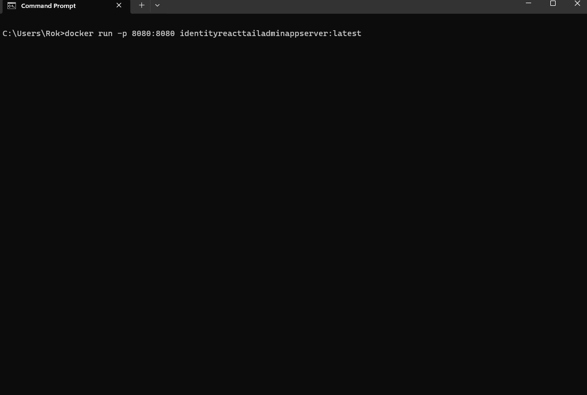

# .Net8 Identity API React TailAdmin Sample

Since React templates in Visual Studio don't include the option to use ASP.NET identity APIs here is an example of how to add it. It shows how to use:
- Use Identity API Endpoints
- Extend identity user with custom fields
- Use Roles
- Integrate with Tailwind CSS Admin Dashboard Template (https://tailadmin.com/)
- build container

